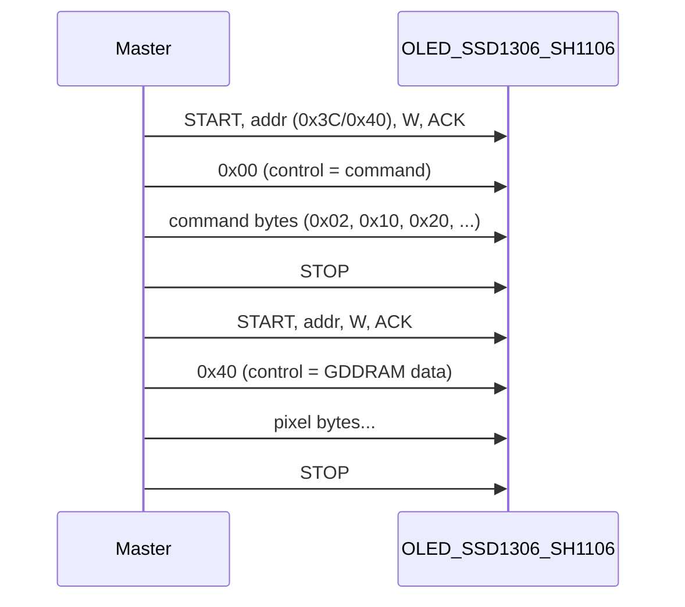

# Análisis: trace I2C vs datasheets OLED (SSD1306 / SH1106)

*(English: [I2C_TRACE_OLED_ANALYSIS.md](I2C_TRACE_OLED_ANALYSIS.md))*

## 1. Fuentes utilizadas

- **Carpeta datasheets** (este directorio): `SSD1306.pdf`, `sh1106_datasheet.pdf`, [test-frame-00.txt](test-frame-00.txt) y [test-frame-01.txt](test-frame-01.txt) (salida del sniffer I2C).
- **Formato del sniffer**: definido en [esp32-i2c-sniffer/README.md](../esp32-i2c-sniffer/README.md) y [esp32-i2c-sniffer/main/i2c_sniffer.c](../esp32-i2c-sniffer/main/i2c_sniffer.c).
- **Comandos SSD1306/SH1106**: tablas de los PDF (y referencias públicas: control byte 0x00/0x40, comandos 0x02, 0x10, 0x20, 0x21, 0x22, 0x40, 0x81, 0x8D, 0xA8, 0xAE/0xAF, 0xB0, 0xD3, etc.).
- **Contexto del bus**: en el hardware de la captura hay **un solo dispositivo** en el bus I2C (la pantalla OLED); no hay ningún otro esclavo.

---

## 2. Formato del trace I2C (test-frame-00.txt y test-frame-01.txt)

Cada línea = una transacción I2C (START → … → STOP). Campos:

| Campo         | Significado                    | Ejemplo    |
| ------------- | ------------------------------ | ---------- |
| **S**         | START                          | S          |
| **0xNN**      | Dirección esclava I2C (7 bits) | 0x3C, 0x40 |
| **W** / **R** | Write / Read                   | W          |
| **A** / **N** | ACK / NACK tras la dirección   | A          |
| **0xNN** …    | Bytes de datos (hex)           | 0x00, 0x0F |
| **P**         | STOP                           | P          |

Ejemplo: `S,0x3C,W,A,0x00,0x0F,0x01,P` → dirección **0x3C**, Write, ACK, datos **0x00 0x0F 0x01**, STOP.

Las líneas sin **P** son transacciones cortadas por un nuevo START (ej. líneas 64, 78, 102).

---

## 3. Modelo I2C de SSD1306 / SH1106 (según datasheets)

- **Primer byte de datos** = byte de control:
  - **0x00** → los siguientes bytes son **comandos**.
  - **0x40** → los siguientes bytes son **datos de GDDRAM** (píxeles).
- Direcciones I2C típicas: **0x3C** (0x78) o **0x3D** (0x7A) en 7 bits.

### 3.1 Tabla de comandos/registros (SSD1306 / SH1106, según PDF)

Referencia: **SSD1306.pdf** y **sh1106_datasheet.pdf**, sección “Command Table” / “9. Command Table”.

| Código (hex) | Nombre en datasheet | Parámetro | Significado del registro/valor |
|--------------|----------------------|-----------|---------------------------------|
| **0xAE** | Display OFF | — | Apaga toda la pantalla; la GDDRAM se mantiene. |
| **0xAF** | Display ON | — | Enciende la pantalla con el contenido actual de la GDDRAM. |
| **0xA8** | Set Multiplex Ratio | 1 byte | Número de líneas COM activas. **Valor = M−1**, M = 16…64. Ej.: **0x3F** → 64 líneas (128×64); **0x27** → 40 líneas (p. ej. 72×40). |
| **0xD3** | Set Display Offset | 1 byte (0–63) | Desplazamiento vertical (en líneas COM). **0x00** = sin desplazamiento. |
| **0x40–0x7F** | Set Display Start Line | (incluido en byte) | Línea de la GDDRAM que se muestra arriba. **0x40** = línea 0; 0x41 = línea 1; … 0x7F = línea 63. |
| **0xA0** | Segment Remap (reset) | — | Columna 0 → segmento S0 (izquierda). |
| **0xA1** | Segment Remap (set) | — | Columna 0 → segmento S127 (derecha); espejo horizontal. |
| **0xC0** | COM Output Scan Direction (normal) | — | COM0 en la parte superior. |
| **0xC8** | COM Output Scan Direction (remap) | — | COM63 en la parte superior; espejo vertical. |
| **0xDA** | Set COM Pins Hardware Config | 1 byte | Configuración de pines COM. **0x02** = secuencial; **0x12** = alternada (p. ej. 128×64). |
| **0x81** | Set Contrast Control | 1 byte (0x00–0xFF) | Brillo. **0x7F** = medio; **0xFF** = máximo; **0xC1** = valor alto típico. |
| **0xD5** | Set Display Clock Divide Ratio / Oscillator Frequency | 1 byte | [7:4] = divisor de reloj (0–15); [3:0] = frecuencia del oscilador. Típico **0x80**. |
| **0xD9** | Set Pre-charge Period | 1 byte | [7:4] = fase 2; [3:0] = fase 1. Típico **0xF1** o **0x22**. |
| **0xDB** | Set VCOMH Deselect Level | 1 byte | Nivel de deselección VCOM. **0x00**, **0x20**, **0x30**. Típico **0x20**. |
| **0x8D** | Charge Pump Setting | 1 byte | **0x10** = desactivado; **0x14** = activado (recomendado para alimentación 3.3 V). |
| **0x00–0x0F** | Set Lower Column Start Address (Page Addr Mode) | (nibble en el código) | Nibble bajo de la columna de inicio. **0x00** = col 0; **0x02** = col 2 (típico en SH1106 por offset de 132 cols). |
| **0x10–0x1F** | Set Higher Column Start Address (Page Addr Mode) | (nibble en el código) | Nibble alto de la columna de inicio. **0x10** = 0; **0x17** = 7 (columna 0x72 = 114). |
| **0x20** | Set Memory Addressing Mode | 1 byte | **0x00** = Horizontal; **0x01** = Vertical; **0x02** = Page. En Page, se usan 0x00–0x0F, 0x10–0x1F y 0xB0–0xB7. |
| **0x21** | Set Column Address | 2 bytes | Solo en modo Horizontal/Vertical. Byte 1 = columna inicio (0–127); byte 2 = columna fin (0–127). Ej.: 0x00, 0x7F = toda la fila. |
| **0x22** | Set Page Address | 2 bytes | Solo en modo Horizontal/Vertical. Byte 1 = página inicio (0–7); byte 2 = página fin (0–7). |
| **0xB0–0xB7** | Set Page Start Address (Page Addr Mode) | (página en el código) | Página actual (0–7). Cada página = 8 filas. **0xB0** = página 0; **0xB7** = página 7. |

SH1106: memoria **132×64**; suele usarse **offset de columna baja 0x02** respecto a SSD1306 (128 columnas visibles).

---

## 4. Direcciones y datos en test-frame-00.txt (un solo dispositivo)

**Solo hay un dispositivo en el bus I2C** (la OLED). Por tanto, todo el tráfico del trace va dirigido a ese único esclavo.

En el trace, el **primer 0xNN** de cada línea es lo que el sniffer interpreta como **dirección I2C (7 bit)**. Aparecen muchos valores distintos: 0x00, 0x01, 0x02, 0x03, 0x07, 0x09, 0x10, 0x12, 0x13, 0x17, 0x20, 0x21, 0x23, 0x39, 0x40, 0x41, 0x43, 0x50, 0x5F.

Dado que el bus tiene un solo esclavo, esa variedad no puede ser de varios dispositivos. La explicación coherente es **desincronización del sniffer**: cuando el analizador no detecta correctamente un START (o pierde el byte de dirección), el primer byte que captura y muestra como “dirección” es en realidad el **primer byte de datos** enviado al OLED. Así:

- Las líneas donde el “primer byte” es **0x00** o **0x40** encajan con el **byte de control** del protocolo SSD1306/SH1106 (0x00 = comandos, 0x40 = datos GDDRAM).
- Las que muestran **0x02**, **0x10**, **0x20**, etc. encajan con **comandos** del display (Set Lower Column, Set Higher Column, Memory Mode, etc.).

La **dirección I2C real** del OLED es una sola. En [test-frame-01.txt](test-frame-01.txt) aparece **una vez** la dirección **0x3C** (línea 862), que confirma que el display está en **0x3C** (7 bits). En los traces, **0x40** es el valor que más veces aparece como “dirección” cuando las transacciones parecen completas; puede deberse a desalineación (0x3C leído como 0x40) o a que el primer byte capturado sea el byte de control **0x40** (modo datos). El resto de valores “como dirección” se interpretan como bytes de control o de comando capturados como primer byte al perder el sniffer la sincronía con el bus.

---

## 5. Coherencia con los registros/comandos de los PDF

### Transacciones que encajan con SSD1306/SH1106

- **`S,0x40,W,A,0x00,W,A,P`** (línea 84, 200): dirección 0x40, datos **0x00** → byte de control **0x00** = “siguiente sería comando”. Tiene sentido como inicio de secuencia de comandos.
- **`S,0x40,W,A,0x00,W,A,0x1E,0x00`** (línea 200): **0x00** (control = comandos) y luego **0x1E, 0x00**. 0x1E no es un comando estándar único; podría ser parámetro (p.ej. contraste u otro) o parte de una secuencia; 0x00 sí es comando (Set Lower Column 0x00). Coherente con “modo comando” + parámetros/columnas.
- **`S,0x40,W,A,0x02,W,A,P`** (líneas 65, 103, 146, 184, 221, 258): datos **0x02** (y a veces más). En SSD1306/SH1106, **0x02** es “Set Lower Column” (nibble bajo de columna). Tiene sentido.
- **`S,0x40,W,A,0x00,W,A,P`** (líneas 66, 104, 185, 222, 259): **0x00** como primer dato → de nuevo “modo comando”. Válido.
- **`S,0x20,W,A,P`** (159, 215): dirección 0x20, Write, sin datos. En el estándar, **0x20** es Memory Addressing Mode; si el dato va en una transacción anterior/posterior o se asume por defecto, es compatible.
- **`S,0x20,R,A,0x83`** (168): el sniffer muestra “dirección” 0x20 y Read; con un solo dispositivo, 0x20 puede ser un byte de comando (Memory Mode) capturado como si fuera dirección; el OLED no suele responder con datos por I2C, así que el Read/NACK puede ser artefacto o intento de lectura fallido.
- **`S,0x40,W,A,0x40,...`** (64, 78, 102, 145, 166, 183, 190, 197, 220, 257): cuando la dirección mostrada es 0x40, el primer dato **0x40** es el byte de control “datos GDDRAM”. Coincide con escritura de píxeles.
- **`S,0x10,W,...`** (5, 18, 139, 251): “dirección” **0x10** con un solo dispositivo → casi seguro es el **comando** Set Higher Column (0x10) capturado como primer byte; los bytes siguientes serían el resto de la secuencia hacia la OLED.

Resumen: con **un solo dispositivo** en el bus, todo el tráfico es hacia la OLED. Las secuencias donde el primer byte es **0x00** (modo comando), **0x40** (modo datos) o comandos como **0x02**, **0x10**, **0x20** son **consistentes** con el protocolo SSD1306/SH1106; la mezcla de “direcciones” en el trace se explica por desincronización del sniffer, que a veces toma el primer byte de datos como si fuera la dirección.

### Posibles operaciones deducidas

1. **Inicialización / modo comando**: varias líneas con **0x00** como primer dato (control = comandos).
2. **Configuración de columna**: **0x02** como dato (Set Lower Column 0x02); combinado con 0x10 en otras transacciones sería “Set Higher Column” + “Set Lower Column”.
3. **Escritura de GDDRAM**: transacciones con primer dato **0x40** (modo datos) indican envío de datos de pantalla.
4. **Memory mode / direccionamiento**: aparición de **0x20** como dirección o en datos podría relacionarse con Memory Addressing Mode (0x20) si ese byte viaja como comando en alguna secuencia.

Los **reads** (R) y NACK (N) en el trace, con un solo esclavo, suelen indicar que el master intentó leer y el OLED no respondió con datos (o el sniffer capturó mal); los controladores OLED se usan normalmente solo por escritura por I2C.

---

## 6. Conclusión

- **¿Tiene sentido el trace respecto a los registros de los PDF?**  
  **Sí**, para la parte que se puede asociar a un dispositivo tipo SSD1306/SH1106:
  - Uso de **0x00** (comandos) y **0x40** (datos GDDRAM) como primer byte de datos.
  - Presencia de **0x02** (Set Lower Column) y de secuencias que encajan con configuración de columnas y escritura de imagen.
- **Operaciones que se están haciendo (interpretación)**:
  1. Selección de **modo comando** (0x00) y envío de comandos (p.ej. columna baja 0x02).
  2. Selección de **modo datos** (0x40) y envío de **datos de GDDRAM** (actualización de píxeles).
  3. Posible configuración de **modo de direccionamiento** (0x20) y de columnas/páginas, según las secuencias con 0x00 y 0x02/0x10.

El análisis exhaustivo con **test-frame-01.txt** (varios resets del display) **confirma la dirección I2C 0x3C** y que la secuencia que se repite es coherente con init + escritura de pantalla según SSD1306/SH1106. Para validar la secuencia exacta de inicialización byte a byte, conviene contrastar con las tablas de comandos completas en [SSD1306.pdf](SSD1306.pdf) y [sh1106_datasheet.pdf](sh1106_datasheet.pdf) (páginas “Command Table” / “I2C Protocol”).

---

## 7. Análisis exhaustivo con test-frame-01.txt (múltiples resets)

El archivo [test-frame-01.txt](test-frame-01.txt) contiene **varias capturas del mismo proceso**: se tomó el tráfico entre el microcontrolador y el display y se **reseteó el display varias veces** para obtener **múltiples repeticiones de la secuencia de inicialización**. Esto permite:

- Confirmar la **dirección I2C real** del OLED cuando el sniffer la captura correctamente.
- Identificar el **patrón que se repite** tras cada reset (inicialización + uso).
- Distinguir ruido/desincronización de transacciones reales.

### 7.1 Estadísticas del trace (test-frame-01.txt)

| Métrica | Valor |
|--------|--------|
| **Líneas totales** | 948 |
| **Líneas solo `S` o `S,P`** (transacción vacía o cortada) | 749 |
| **Líneas con “dirección” + datos** (transacción con al menos un byte) | 198 |
| **Apariciones del bloque** `S,0x40,W,A` → `S,0x02,W,A,P` → `S,0x00,W,A,P` | **15 veces** (coherente con varios ciclos de init) |
| **Transacciones con datos multi-byte** (varios bytes en la misma línea) | 9 |

La gran cantidad de líneas `S` o `S,P` sin datos indica muchas transacciones donde el sniffer **no capturó el byte de dirección** (o capturó un START/STOP suelto), lo que refuerza la hipótesis de desincronización cuando el bus está muy activo.

### 7.2 Dirección I2C real: 0x3C

En todo el archivo **solo aparece una vez** la dirección **0x3C** como primer byte de una transacción:

- **Línea 862**: `S,0x3C,W,N`

Interpretación:

- **0x3C** es la dirección I2C en 7 bits del OLED (0x78 en 8 bits), estándar SSD1306/SH1106.
- **W** = Write, **N** = NACK: el esclavo no hizo ACK. Puede deberse a: display ocupado, reset reciente, o que el sniffer capturó el NACK de otro byte. En cualquier caso, **confirma que el display está en 0x3C**.

En el resto del trace, cuando el sniffer muestra “dirección” **0x40**, es muy probable que sea un **desplazamiento de un bit** (0x3C → 0x78; si se pierde el LSB o hay ruido, puede leerse 0x40) o que el primer byte capturado sea ya el **byte de control** 0x40 (modo datos). La aparición única de 0x3C confirma que **la dirección real del único dispositivo es 0x3C**.

### 7.3 Patrón repetido: secuencia de inicialización / uso

El bloque que más se repite (unas **15 veces**) es:

1. `S,0x40,W,A`  
2. `S,0x02,W,A,P`  
3. `S,0x00,W,A,P`  

Interpretación con **un solo dispositivo en 0x3C** y desincronización:

- **0x40** como “dirección” suele corresponder a transacciones donde el primer byte capturado es el **byte de control 0x40** (datos GDDRAM) o a la dirección 0x3C mal alineada.
- **0x02** como “dirección” = casi seguro el **comando Set Lower Column** (0x02) tomado como primer byte.
- **0x00** como “dirección” = **byte de control 0x00** (modo comando) tomado como primer byte.

En una **transacción bien formada** hacia 0x3C, la secuencia lógica sería: **START → 0x3C+W → ACK → 0x00 (control) → 0x02 (Set Lower Column) → 0x00 (Set Lower Column = 0)** → STOP. El sniffer, al perder el START o el byte de dirección, “corta” esa secuencia en varias líneas, dando lugar al patrón observado.

Además de ese bloque, aparecen una y otra vez:

- `S,0x40,W,A` sin datos (o con datos en líneas siguientes): selección de destino (0x3C) y envío de **0x40** (modo datos) o **0x00** (modo comando).
- `S,0x00,W,A,P` y `S,0x00,W,A` con/sin más bytes: modo comando.
- `S,0x10,W,...`, `S,0x18,W`, `S,0x20,W,P`, etc.: comandos **Set Higher Column** (0x10), u otros, capturados como primer byte.

Todo ello es coherente con **varias repeticiones de la misma secuencia**: init (modo comando + Set Lower Column / Set Higher Column) y luego escritura de GDDRAM (modo 0x40).

### 7.4 Transacciones con varios bytes de datos (comandos con parámetro)

En test-frame-01.txt aparecen **9 líneas** donde hay más de un byte de datos en la misma transacción. Son candidatas a **comandos con parámetro** o **stream de comandos**:

| Línea | Trace | Interpretación posible |
|-------|--------|-------------------------|
| 260 | `S,0x00,W,A,0x30` | Control 0x00 + comando/parámetro 0x30 |
| 313 | `S,0x00,W,A,0x07` | Control 0x00 + parámetro 0x07 (p. ej. contraste o columna) |
| 350 | `S,0x00,W,A,0xC1` | Control 0x00 + 0xC1 (parámetro; si en otra transacción se envió 0x81 Set Contrast, 0xC1 sería el valor de contraste) |
| 477 | `S,0x10,W,A,0x07` | Comando 0x10 (Set Higher Column) + nibble 0x07 |
| 528 | `S,0x00,W,A,0x1F` | Control 0x00 + parámetro 0x1F |
| 631 | `S,0x02,W,A,0x0F,0x9F` | Comando 0x02 (Set Lower Column) + **0x0F, 0x9F**: podría ser **Set Column Address** (0x21) con start=0x0F, end=0x9F (columnas 15–159), si el 0x02 fuera 0x21 por desincronización, o dos comandos en una misma transacción |
| 679 | `S,0x00,W,A,0x00` | Control 0x00 + comando 0x00 (Set Lower Column = 0) |
| 851 | `S,0x00,W,A,0x00` | Idem |
| 946 | `S,0x40,W,A,0x0F` | Control 0x40 (datos) + primer byte de GDDRAM 0x0F |

De especial interés:

- **0xC1** (línea 350): valor típico de **Set Contrast** (0x81 + valor). 0xC1 = 193 en decimal, dentro del rango 0x00–0xFF del datasheet.
- **0x0F, 0x9F** (línea 631): encajan con **Set Column Address** (0x21) con inicio 0x0F y fin 0x9F (pantalla 128 columnas: 0–127; 0x9F=159 podría ser para SH1106 con 132 columnas o un rango ampliado).
- **0x0F** al final (línea 946): primer byte de datos de pantalla (0x40 = modo datos) o parámetro de contraste (0x81 + 0x0F).

### 7.5 Resumen del análisis exhaustivo (test-frame-01)

1. **Dirección I2C del único dispositivo**: **0x3C** (confirmada por la única aparición explícita en el trace, línea 862).
2. **Secuencia que se repite tras cada reset**: init con **modo comando (0x00)** + **Set Lower Column (0x02)** y **Set Lower Column 0x00**, seguido de uso con **modo datos (0x40)** y escritura de GDDRAM; aparecen también **Set Higher Column (0x10)** y otras órdenes (0x18, 0x20, etc.) compatibles con SSD1306/SH1106.
3. **Desincronización**: la mayoría de líneas son `S` o `S,P` sin datos; cuando hay datos, muchos “primer byte” son en realidad **control (0x00, 0x40)** o **comandos (0x02, 0x10, 0x20, …)**. Eso encaja con un sniffer que a menudo pierde el byte de dirección y muestra el primer byte de datos como si fuera la dirección.
4. **Comandos con parámetro**: contrast (0x81 + 0xC1), column address (0x0F, 0x9F), y otros bytes (0x07, 0x1F, 0x00, 0x0F) coherentes con el protocolo de los datasheets.

En conjunto, **test-frame-01** refuerza que el tráfico es **100% hacia un único OLED en 0x3C** y que la secuencia de inicialización y uso coincide con el protocolo SSD1306/SH1106 descrito en los PDF.

---

## 8. Inicialización detallada: registros llenados y valores (según PDF y traces)

A continuación se listan los **registros/comandos** que se pueden identificar en los traces (test-frame-00.txt y test-frame-01.txt), con el **valor** observado y el **significado** según los datasheets SSD1306 y SH1106. El orden no es necesariamente el de la secuencia real (por desincronización del sniffer); se agrupa por tipo de comando.

### 8.1 Registros identificados en los traces

| Registro (datasheet) | Código | Valor(es) en trace | Dónde aparece | Significado del valor |
|----------------------|--------|--------------------|--------------|------------------------|
| **Byte de control (comandos)** | 0x00 | — | Múltiples líneas (ej. S,0x00,W,A,P) | Indica que los bytes siguientes son **comandos**, no datos GDDRAM. No es un registro del display; es parte del protocolo I2C del controlador. |
| **Byte de control (datos)** | 0x40 | — | Múltiples líneas (ej. S,0x40,W,A,...) | Indica que los bytes siguientes son **datos GDDRAM** (píxeles). Tampoco es un registro; es el selector de stream. |
| **Set Lower Column Start Address** | 0x00–0x0F | **0x00**, **0x02** | test-frame-00: 0x02 en varias líneas; 0x00 en S,0x00,W,A,P y en S,0x00,W,A,0x00. test-frame-01: 0x02 en bloque repetido; 0x00 en S,0x00,W,A,0x00 (679, 851). | **0x00**: columna de inicio = 0 (nibble bajo). **0x02**: columna de inicio nibble bajo = 2; típico en **SH1106** (132 columnas) para alinear la ventana visible; en SSD1306 (128 cols) también se usa en algunos drivers. Define desde qué columna se escribe en modo página. |
| **Set Higher Column Start Address** | 0x10–0x1F | **0x10**, **0x07** (nibble) | test-frame-01: S,0x10,W,A,0x07 (477); S,0x10,W,... en varias líneas. | **0x10**: nibble alto = 0 (columnas 0x00–0x0F). **0x10\|0x07 = 0x17**: nibble alto = 7 (columnas 0x70–0x7F). Define la “mitad alta” de la dirección de columna en modo página. |
| **Memory Addressing Mode** | 0x20 | **0x00** (posible) | test-frame-01: S,0x20,W,A,P (682); S,0x20,W,P; S,0x20,R,N,P. | Si el byte siguiente (en otra transacción) es **0x00**: modo **Horizontal**. Si fuera **0x01**: Vertical; **0x02**: Page. En los traces no se ve el parámetro en la misma línea; si se usa 0x20, el valor típico es 0x00 (Horizontal) o 0x02 (Page). |
| **Set Column Address** (modo Horizontal/Vertical) | 0x21 | **0x0F**, **0x9F** | test-frame-01 línea 631: S,0x02,W,A,**0x0F,0x9F**. (El “0x02” puede ser desincronización de 0x21.) | **Columna inicio = 0x0F (15), columna fin = 0x9F (159)**. En SSD1306 (128 cols) el fin sería 0x7F (127); **0x9F** encaja con **SH1106** (132 columnas, fin lógico 0x83). 0x9F podría ser valor erróneo o rango ampliado. En cualquier caso: define el rango de columnas para la siguiente escritura de GDDRAM. |
| **Set Display Start Line** | 0x40–0x7F | **0x40**, **0x1E** (posible) | test-frame-00 línea 200: S,0x00,W,A,**0x1E,0x00**. Si 0x1E es comando: **0x40\|0x1E = 0x5E** = Start Line 30. | **0x40**: primera línea mostrada = línea 0 de la GDDRAM. **0x5E (0x40+0x1E)**: primera línea = 30; desplaza la imagen verticalmente. |
| **Set Contrast Control** | 0x81 | **0xC1**, **0x0F** (posibles) | test-frame-01: S,0x00,W,A,**0xC1** (350); S,0x40,W,A,**0x0F** (946). test-frame-00: S,0x40,W,A,0x0F (70). | **0xC1 (193)**: contraste alto, muy usado en inicialización. **0x0F (15)**: contraste bajo (si 0x0F va tras 0x81 en otra transacción). El datasheet permite 0x00–0xFF; 0xC1 es un valor típico en ejemplos. |
| **Charge Pump Setting** | 0x8D | (no identificado con valor en trace) | — | En init típico se envía **0x8D** + **0x14** (charge pump ON). No se ve una línea con 0x8D y 0x14 explícitos; podrían estar en transacciones cortadas o con “dirección” desincronizada. |
| **Set Multiplex Ratio** | 0xA8 | (no identificado con valor en trace) | — | Típico: **0xA8** + **0x3F** (64 líneas) o **0x27** (40 líneas). No aparece una secuencia clara 0xA8 + parámetro en las líneas analizadas; podría estar en transacciones donde el sniffer perdió bytes. |
| **Display OFF / ON** | 0xAE / 0xAF | (no identificados explícitamente) | — | Init estándar: primero **0xAE** (Display OFF), luego secuencia de configuración, al final **0xAF** (Display ON). No se ven como único byte en una línea; podrían estar mezclados en streams de comandos. |
| **Set Display Offset** | 0xD3 | **0x00** (típico) | Podría estar en secuencias tipo S,0x00,W,A,0x?? si el segundo byte fuera 0xD3 y el tercero 0x00. | **0x00**: sin desplazamiento vertical (COM0 alineado con la primera fila lógica). |
| **Set Pre-charge / VCOMH / COM Pins / Clock** | 0xD5, 0xD9, 0xDA, 0xDB | (no identificados con valores en trace) | — | En init típico se envían 0xD5, 0xD9, 0xDA, 0xDB con un byte de parámetro cada uno. No se distinguen en las líneas multi-byte analizadas; es posible que vayan en transacciones cortadas o que el primer byte se muestre como “dirección”. |

### 8.2 Resumen: qué registros se “llenaron” y con qué valores (interpretación)

Con la información que dan los traces y la tabla de comandos de los PDF:

| Registro (nombre en datasheet) | ¿Aparece en trace? | Valor interpretado | Significado |
|--------------------------------|--------------------|--------------------|-------------|
| **Set Lower Column Start Address** | Sí (repetido) | **0x00**, **0x02** | Columna de inicio (nibble bajo): 0 y 2. **0x02** sugiere uso tipo **SH1106** o offset de 2. |
| **Set Higher Column Start Address** | Sí | **0x10**, **0x17** (nibble alto 0 y 7) | Nibble alto de la columna de inicio. |
| **Memory Addressing Mode** | Posible | **0x20** (parámetro no visto) | Selección de modo (Horizontal / Vertical / Page). |
| **Set Column Address** | Sí (test-frame-01) | **0x0F, 0x9F** | Rango de columnas para escritura (inicio 15, fin 159; compatible con SH1106 132 columnas). |
| **Set Display Start Line** | Posible | **0x40** o **0x5E** (línea 30) | Qué línea de la GDDRAM se muestra arriba. |
| **Set Contrast Control** | Sí | **0xC1** (y quizá **0x0F**) | Brillo del display; 0xC1 = valor alto típico. |
| **Charge Pump, Multiplex, Display ON/OFF, Offset, D5/D9/DA/DB** | No claros en trace | — | Forman parte de la init estándar en los PDF; en los traces no se pueden asignar a líneas concretas por desincronización o transacciones cortadas. |

### 8.3 Secuencia lógica de inicialización (según datasheets)

Orden típico recomendado en los PDF (SSD1306/SH1106):

1. **0xAE** — Display OFF  
2. **0xD5** + byte — Display Clock Divide  
3. **0xA8** + byte — Multiplex Ratio (p. ej. 0x3F o 0x27)  
4. **0xD3** + byte — Display Offset (p. ej. 0x00)  
5. **0x40** (o 0x40|n, n=0…63) — Set Start Line  
6. **0xA1** / **0xA0**, **0xC8** / **0xC0** — Segment remap, COM scan  
7. **0xDA** + byte — COM pins  
8. **0x81** + byte — Contrast  
9. **0xD9** + byte — Pre-charge  
10. **0xDB** + byte — VCOMH  
11. **0x8D** + **0x14** — Charge pump ON  
12. **0xAF** — Display ON  
13. **0x20** + byte — Memory Addressing Mode  
14. **0x21** + 2 bytes o **0x00/0x10** (modo página) — Column/Page para posicionar y luego **0x40** + bytes — Escritura de GDDRAM  

En los traces se ve sobre todo: **posicionamiento de columna (0x00, 0x02, 0x10, 0x17)**, posible **Set Column Address (0x0F, 0x9F)**, **contraste (0xC1)** y **escritura de datos (0x40 + bytes)**. El resto de registros de la tabla del datasheet no se pueden asociar con certeza a líneas concretas por la forma en que el sniffer corta las transacciones.

---

## Diagrama de flujo del protocolo (OLED)

Los traces analizados (test-frame-00.txt y test-frame-01.txt) contienen transacciones que siguen este patrón (control 0x00 o 0x40 + bytes siguientes). La dirección I2C del único dispositivo queda confirmada como **0x3C** gracias a la aparición explícita en test-frame-01.txt. La información del analizador I2C es coherente con los registros y el protocolo de los datasheets de los controladores OLED.
