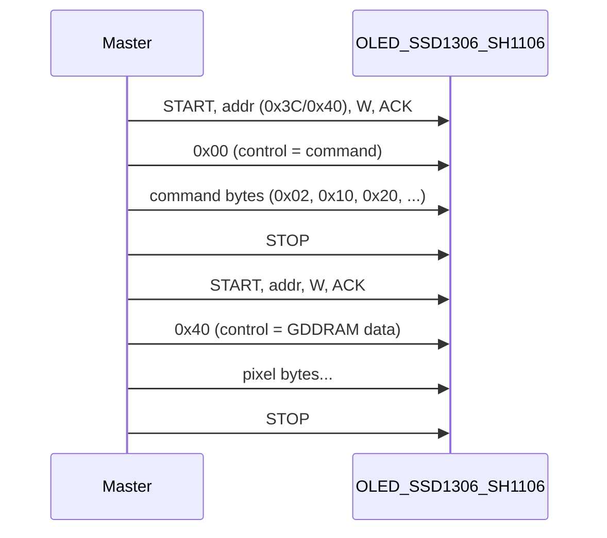

# I2C Trace vs OLED Datasheets Analysis (SSD1306 / SH1106)

*(Español: [ANALISIS_TRACE_I2C_OLED.md](ANALISIS_TRACE_I2C_OLED.md))*

## 1. Sources

- **Datasheets folder** (this directory): `SSD1306.pdf`, `sh1106_datasheet.pdf`, [test-frame-00.txt](test-frame-00.txt) and [test-frame-01.txt](test-frame-01.txt) (I2C sniffer output).
- **Sniffer format**: defined in [esp32-i2c-sniffer/README.md](../esp32-i2c-sniffer/README.md) and [esp32-i2c-sniffer/main/i2c_sniffer.c](../esp32-i2c-sniffer/main/i2c_sniffer.c).
- **SSD1306/SH1106 commands**: tables from the PDFs (and public references: control byte 0x00/0x40, commands 0x02, 0x10, 0x20, 0x21, 0x22, 0x40, 0x81, 0x8D, 0xA8, 0xAE/0xAF, 0xB0, 0xD3, etc.).
- **Bus context**: in the capture hardware there is **only one device** on the I2C bus (the OLED display); no other slave is present.

---

## 2. I2C Trace Format (test-frame-00.txt and test-frame-01.txt)

Each line = one I2C transaction (START → … → STOP). Fields:

| Field         | Meaning                         | Example    |
| ------------- | ------------------------------- | ---------- |
| **S**         | START                           | S          |
| **0xNN**      | I2C slave address (7 bits)      | 0x3C, 0x40 |
| **W** / **R** | Write / Read                    | W          |
| **A** / **N** | ACK / NACK after address        | A          |
| **0xNN** …    | Data bytes (hex)                | 0x00, 0x0F |
| **P**         | STOP                            | P          |

Example: `S,0x3C,W,A,0x00,0x0F,0x01,P` → address **0x3C**, Write, ACK, data **0x00 0x0F 0x01**, STOP.

Lines without **P** are transactions cut short by a new START (e.g. lines 64, 78, 102).

---

## 3. SSD1306 / SH1106 I2C Model (per datasheets)

- **First data byte** = control byte:
  - **0x00** → following bytes are **commands**.
  - **0x40** → following bytes are **GDDRAM data** (pixels).
- Typical I2C addresses: **0x3C** (0x78) or **0x3D** (0x7A) in 7-bit form.

### 3.1 Command/Register Table (SSD1306 / SH1106, per PDF)

Reference: **SSD1306.pdf** and **sh1106_datasheet.pdf**, section “Command Table” / “9. Command Table”.

| Code (hex) | Name in datasheet | Parameter | Register/value meaning |
|------------|-------------------|-----------|-------------------------|
| **0xAE** | Display OFF | — | Turns off the entire display; GDDRAM content is retained. |
| **0xAF** | Display ON | — | Turns on the display with current GDDRAM content. |
| **0xA8** | Set Multiplex Ratio | 1 byte | Number of active COM lines. **Value = M−1**, M = 16…64. E.g. **0x3F** → 64 lines (128×64); **0x27** → 40 lines (e.g. 72×40). |
| **0xD3** | Set Display Offset | 1 byte (0–63) | Vertical shift (in COM lines). **0x00** = no offset. |
| **0x40–0x7F** | Set Display Start Line | (included in byte) | GDDRAM line shown at top. **0x40** = line 0; 0x41 = line 1; … 0x7F = line 63. |
| **0xA0** | Segment Remap (reset) | — | Column 0 → segment S0 (left). |
| **0xA1** | Segment Remap (set) | — | Column 0 → segment S127 (right); horizontal mirror. |
| **0xC0** | COM Output Scan Direction (normal) | — | COM0 at top. |
| **0xC8** | COM Output Scan Direction (remap) | — | COM63 at top; vertical mirror. |
| **0xDA** | Set COM Pins Hardware Config | 1 byte | COM pin configuration. **0x02** = sequential; **0x12** = alternate (e.g. 128×64). |
| **0x81** | Set Contrast Control | 1 byte (0x00–0xFF) | Brightness. **0x7F** = mid; **0xFF** = max; **0xC1** = typical high value. |
| **0xD5** | Set Display Clock Divide Ratio / Oscillator Frequency | 1 byte | [7:4] = clock divide (0–15); [3:0] = oscillator frequency. Typical **0x80**. |
| **0xD9** | Set Pre-charge Period | 1 byte | [7:4] = phase 2; [3:0] = phase 1. Typical **0xF1** or **0x22**. |
| **0xDB** | Set VCOMH Deselect Level | 1 byte | VCOM deselect level. **0x00**, **0x20**, **0x30**. Typical **0x20**. |
| **0x8D** | Charge Pump Setting | 1 byte | **0x10** = disabled; **0x14** = enabled (recommended for 3.3 V supply). |
| **0x00–0x0F** | Set Lower Column Start Address (Page Addr Mode) | (nibble in code) | Low nibble of start column. **0x00** = col 0; **0x02** = col 2 (typical on SH1106 due to 132-col offset). |
| **0x10–0x1F** | Set Higher Column Start Address (Page Addr Mode) | (nibble in code) | High nibble of start column. **0x10** = 0; **0x17** = 7 (column 0x72 = 114). |
| **0x20** | Set Memory Addressing Mode | 1 byte | **0x00** = Horizontal; **0x01** = Vertical; **0x02** = Page. In Page mode, 0x00–0x0F, 0x10–0x1F and 0xB0–0xB7 are used. |
| **0x21** | Set Column Address | 2 bytes | Only in Horizontal/Vertical mode. Byte 1 = start column (0–127); byte 2 = end column (0–127). E.g. 0x00, 0x7F = full row. |
| **0x22** | Set Page Address | 2 bytes | Only in Horizontal/Vertical mode. Byte 1 = start page (0–7); byte 2 = end page (0–7). |
| **0xB0–0xB7** | Set Page Start Address (Page Addr Mode) | (page in code) | Current page (0–7). Each page = 8 rows. **0xB0** = page 0; **0xB7** = page 7. |

SH1106: **132×64** memory; **lower column offset 0x02** is often used vs SSD1306 (128 visible columns).

---

## 4. Addresses and Data in test-frame-00.txt (single device)

**There is only one device on the I2C bus** (the OLED). So all trace traffic is directed to that single slave.

In the trace, the **first 0xNN** on each line is what the sniffer interprets as **I2C address (7 bit)**. Many different values appear: 0x00, 0x01, 0x02, 0x03, 0x07, 0x09, 0x10, 0x12, 0x13, 0x17, 0x20, 0x21, 0x23, 0x39, 0x40, 0x41, 0x43, 0x50, 0x5F.

With only one slave on the bus, that variety cannot be multiple devices. The consistent explanation is **sniffer desynchronization**: when the analyzer does not correctly detect a START (or misses the address byte), the first byte it captures and shows as “address” is actually the **first data byte** sent to the OLED. Thus:

- Lines where the “first byte” is **0x00** or **0x40** match the **control byte** of the SSD1306/SH1106 protocol (0x00 = commands, 0x40 = GDDRAM data).
- Lines showing **0x02**, **0x10**, **0x20**, etc. match **display commands** (Set Lower Column, Set Higher Column, Memory Mode, etc.).

The **actual I2C address** of the OLED is a single value. In [test-frame-01.txt](test-frame-01.txt) address **0x3C** appears **once** (line 862), which confirms the display is at **0x3C** (7 bits). In the traces, **0x40** is the value that appears most often as “address” when transactions look complete; this may be due to misalignment (0x3C read as 0x40) or the first captured byte being the control byte **0x40** (data mode). The remaining “address” values are interpreted as control or command bytes captured as the first byte when the sniffer loses sync with the bus.

---

## 5. Consistency with PDF Registers/Commands

### Transactions Matching SSD1306/SH1106

- **`S,0x40,W,A,0x00,W,A,P`** (line 84, 200): address 0x40, data **0x00** → control byte **0x00** = “next would be command”. Makes sense as start of command sequence.
- **`S,0x40,W,A,0x00,W,A,0x1E,0x00`** (line 200): **0x00** (control = commands) then **0x1E, 0x00**. 0x1E is not a single standard command; it could be a parameter (e.g. contrast or other) or part of a sequence; 0x00 is command (Set Lower Column 0x00). Consistent with “command mode” + parameters/columns.
- **`S,0x40,W,A,0x02,W,A,P`** (lines 65, 103, 146, 184, 221, 258): data **0x02** (and sometimes more). In SSD1306/SH1106, **0x02** is “Set Lower Column” (column low nibble). Makes sense.
- **`S,0x40,W,A,0x00,W,A,P`** (lines 66, 104, 185, 222, 259): **0x00** as first data → again “command mode”. Valid.
- **`S,0x20,W,A,P`** (159, 215): address 0x20, Write, no data. In the standard, **0x20** is Memory Addressing Mode; if the data byte is in a previous/next transaction or assumed by default, this is compatible.
- **`S,0x20,R,A,0x83`** (168): sniffer shows “address” 0x20 and Read; with a single device, 0x20 may be a command byte (Memory Mode) captured as address; the OLED typically does not return data over I2C, so the Read/NACK may be an artifact or failed read attempt.
- **`S,0x40,W,A,0x40,...`** (64, 78, 102, 145, 166, 183, 190, 197, 220, 257): when the shown address is 0x40, the first data byte **0x40** is the “GDDRAM data” control byte. Matches pixel write.
- **`S,0x10,W,...`** (5, 18, 139, 251): “address” **0x10** with a single device → almost certainly the **command** Set Higher Column (0x10) captured as first byte; following bytes would be the rest of the sequence to the OLED.

Summary: with **a single device** on the bus, all traffic is to the OLED. Sequences where the first byte is **0x00** (command mode), **0x40** (data mode), or commands like **0x02**, **0x10**, **0x20** are **consistent** with the SSD1306/SH1106 protocol; the mix of “addresses” in the trace is explained by sniffer desynchronization, which sometimes treats the first data byte as the address.

### Inferred Operations

1. **Initialization / command mode**: several lines with **0x00** as first data (control = commands).
2. **Column setup**: **0x02** as data (Set Lower Column 0x02); together with 0x10 in other transactions this would be “Set Higher Column” + “Set Lower Column”.
3. **GDDRAM write**: transactions with first data **0x40** (data mode) indicate display data transfer.
4. **Memory mode / addressing**: appearance of **0x20** as address or in data may relate to Memory Addressing Mode (0x20) if that byte is sent as a command in some sequence.

**Reads** (R) and NACK (N) in the trace, with a single slave, usually indicate that the master tried to read and the OLED did not return data (or the sniffer captured it wrongly); OLED controllers are normally write-only over I2C.

---

## 6. Conclusion

- **Does the trace make sense relative to the PDF registers?**  
  **Yes**, for the part that can be associated with an SSD1306/SH1106-type device:
  - Use of **0x00** (commands) and **0x40** (GDDRAM data) as the first data byte.
  - Presence of **0x02** (Set Lower Column) and sequences that match column setup and image write.
- **Operations being performed (interpretation)**:
  1. **Command mode** selection (0x00) and sending commands (e.g. lower column 0x02).
  2. **Data mode** selection (0x40) and sending **GDDRAM data** (pixel update).
  3. Possible **addressing mode** (0x20) and column/page setup, from sequences with 0x00 and 0x02/0x10.

The detailed analysis with **test-frame-01.txt** (multiple display resets) **confirms I2C address 0x3C** and that the repeating sequence is consistent with init + display write per SSD1306/SH1106. To validate the exact byte-by-byte init sequence, compare with the full command tables in [SSD1306.pdf](SSD1306.pdf) and [sh1106_datasheet.pdf](sh1106_datasheet.pdf) (“Command Table” / “I2C Protocol” pages).

---

## 7. Detailed Analysis with test-frame-01.txt (multiple resets)

The file [test-frame-01.txt](test-frame-01.txt) contains **multiple captures of the same process**: traffic between the microcontroller and the display was captured and the **display was reset several times** to obtain **multiple repetitions of the initialization sequence**. This allows:

- Confirming the **actual I2C address** of the OLED when the sniffer captures it correctly.
- Identifying the **repeating pattern** after each reset (init + use).
- Telling apart noise/desync from real transactions.

### 7.1 Trace Statistics (test-frame-01.txt)

| Metric | Value |
|--------|--------|
| **Total lines** | 948 |
| **Lines with only `S` or `S,P`** (empty or cut transaction) | 749 |
| **Lines with “address” + data** (transaction with at least one byte) | 198 |
| **Occurrences of block** `S,0x40,W,A` → `S,0x02,W,A,P` → `S,0x00,W,A,P` | **15** (consistent with several init cycles) |
| **Multi-byte data transactions** (multiple bytes on same line) | 9 |

The large number of `S` or `S,P`-only lines indicates many transactions where the sniffer **did not capture the address byte** (or captured a lone START/STOP), reinforcing the desync hypothesis when the bus is very active.

### 7.2 Actual I2C Address: 0x3C

**Only once** in the entire file does address **0x3C** appear as the first byte of a transaction:

- **Line 862**: `S,0x3C,W,N`

Interpretation:

- **0x3C** is the 7-bit I2C address of the OLED (0x78 in 8-bit form), standard SSD1306/SH1106.
- **W** = Write, **N** = NACK: the slave did not ACK. This may be due to: display busy, recent reset, or the sniffer capturing the NACK of another byte. In any case, it **confirms the display is at 0x3C**.

Elsewhere in the trace, when the sniffer shows “address” **0x40**, it is likely a **bit shift** (0x3C → 0x78; if the LSB is lost or there is noise, 0x40 may be read) or the first captured byte is already the **control byte** 0x40 (data mode). The single occurrence of 0x3C confirms that **the real address of the only device is 0x3C**.

### 7.3 Repeated Pattern: Init / Use Sequence

The block that repeats most (about **15 times**) is:

1. `S,0x40,W,A`  
2. `S,0x02,W,A,P`  
3. `S,0x00,W,A,P`  

Interpretation with **a single device at 0x3C** and desync:

- **0x40** as “address” usually corresponds to transactions where the first captured byte is the **control byte 0x40** (GDDRAM data) or the address 0x3C misaligned.
- **0x02** as “address” = almost certainly the **Set Lower Column** command (0x02) taken as first byte.
- **0x00** as “address” = **control byte 0x00** (command mode) taken as first byte.

In a **well-formed transaction** to 0x3C, the logical sequence would be: **START → 0x3C+W → ACK → 0x00 (control) → 0x02 (Set Lower Column) → 0x00 (Set Lower Column = 0)** → STOP. The sniffer, by missing the START or the address byte, “splits” that sequence into several lines, producing the observed pattern.

Besides that block, the following appear repeatedly:

- `S,0x40,W,A` with no data (or with data on following lines): destination (0x3C) selection and sending **0x40** (data mode) or **0x00** (command mode).
- `S,0x00,W,A,P` and `S,0x00,W,A` with or without more bytes: command mode.
- `S,0x10,W,...`, `S,0x18,W`, `S,0x20,W,P`, etc.: **Set Higher Column** (0x10) or other commands captured as first byte.

All of this is consistent with **several repetitions of the same sequence**: init (command mode + Set Lower Column / Set Higher Column) and then GDDRAM write (mode 0x40).

### 7.4 Multi-Byte Data Transactions (commands with parameter)

In test-frame-01.txt there are **9 lines** with more than one data byte in the same transaction. They are candidates for **parameterized commands** or **command streams**:

| Line | Trace | Possible interpretation |
|------|--------|--------------------------|
| 260 | `S,0x00,W,A,0x30` | Control 0x00 + command/parameter 0x30 |
| 313 | `S,0x00,W,A,0x07` | Control 0x00 + parameter 0x07 (e.g. contrast or column) |
| 350 | `S,0x00,W,A,0xC1` | Control 0x00 + 0xC1 (parameter; if 0x81 Set Contrast was sent in another transaction, 0xC1 would be contrast value) |
| 477 | `S,0x10,W,A,0x07` | Command 0x10 (Set Higher Column) + nibble 0x07 |
| 528 | `S,0x00,W,A,0x1F` | Control 0x00 + parameter 0x1F |
| 631 | `S,0x02,W,A,0x0F,0x9F` | Command 0x02 (Set Lower Column) + **0x0F, 0x9F**: could be **Set Column Address** (0x21) with start=0x0F, end=0x9F (columns 15–159), if 0x02 were 0x21 due to desync, or two commands in one transaction |
| 679 | `S,0x00,W,A,0x00` | Control 0x00 + command 0x00 (Set Lower Column = 0) |
| 851 | `S,0x00,W,A,0x00` | Same |
| 946 | `S,0x40,W,A,0x0F` | Control 0x40 (data) + first GDDRAM byte 0x0F |

Of particular interest:

- **0xC1** (line 350): typical value for **Set Contrast** (0x81 + value). 0xC1 = 193 decimal, within datasheet range 0x00–0xFF.
- **0x0F, 0x9F** (line 631): match **Set Column Address** (0x21) with start 0x0F and end 0x9F (128-column display: 0–127; 0x9F=159 could be for SH1106 with 132 columns or an extended range).
- **0x0F** at end (line 946): first display data byte (0x40 = data mode) or contrast parameter (0x81 + 0x0F).

### 7.5 Summary of Detailed Analysis (test-frame-01)

1. **I2C address of the single device**: **0x3C** (confirmed by the single explicit occurrence in the trace, line 862).
2. **Sequence repeated after each reset**: init with **command mode (0x00)** + **Set Lower Column (0x02)** and **Set Lower Column 0x00**, followed by use with **data mode (0x40)** and GDDRAM write; **Set Higher Column (0x10)** and other commands (0x18, 0x20, etc.) also appear, compatible with SSD1306/SH1106.
3. **Desynchronization**: most lines are `S` or `S,P` with no data; when there is data, many “first bytes” are actually **control (0x00, 0x40)** or **commands (0x02, 0x10, 0x20, …)**. This fits a sniffer that often misses the address byte and displays the first data byte as the address.
4. **Parameterized commands**: contrast (0x81 + 0xC1), column address (0x0F, 0x9F), and other bytes (0x07, 0x1F, 0x00, 0x0F) consistent with the datasheet protocol.

Overall, **test-frame-01** reinforces that traffic is **100% to a single OLED at 0x3C** and that the init/use sequence matches the SSD1306/SH1106 protocol described in the PDFs.

---

## 8. Detailed Initialization: Registers Written and Values (per PDF and traces)

Below are the **registers/commands** that can be identified in the traces (test-frame-00.txt and test-frame-01.txt), with the **observed value** and **meaning** per the SSD1306 and SH1106 datasheets. Order is not necessarily the real sequence (due to sniffer desync); they are grouped by command type.

### 8.1 Registers Identified in the Traces

| Register (datasheet) | Code | Value(s) in trace | Where it appears | Value meaning |
|---------------------|------|-------------------|------------------|----------------|
| **Control byte (commands)** | 0x00 | — | Multiple lines (e.g. S,0x00,W,A,P) | Indicates following bytes are **commands**, not GDDRAM data. Not a display register; part of the controller I2C protocol. |
| **Control byte (data)** | 0x40 | — | Multiple lines (e.g. S,0x40,W,A,...) | Indicates following bytes are **GDDRAM data** (pixels). Also not a register; stream selector. |
| **Set Lower Column Start Address** | 0x00–0x0F | **0x00**, **0x02** | test-frame-00: 0x02 on several lines; 0x00 in S,0x00,W,A,P and S,0x00,W,A,0x00. test-frame-01: 0x02 in repeated block; 0x00 in S,0x00,W,A,0x00 (679, 851). | **0x00**: start column = 0 (low nibble). **0x02**: start column low nibble = 2; typical on **SH1106** (132 columns) to align visible window; also used on SSD1306 (128 cols) in some drivers. Defines which column write starts at in page mode. |
| **Set Higher Column Start Address** | 0x10–0x1F | **0x10**, **0x07** (nibble) | test-frame-01: S,0x10,W,A,0x07 (477); S,0x10,W,... on several lines. | **0x10**: high nibble = 0 (columns 0x00–0x0F). **0x10\|0x07 = 0x17**: high nibble = 7 (columns 0x70–0x7F). Defines the “high half” of column address in page mode. |
| **Memory Addressing Mode** | 0x20 | **0x00** (possible) | test-frame-01: S,0x20,W,A,P (682); S,0x20,W,P; S,0x20,R,N,P. | If the next byte (in another transaction) is **0x00**: **Horizontal** mode. If **0x01**: Vertical; **0x02**: Page. The parameter is not seen on the same line in the traces; if 0x20 is used, the typical value is 0x00 (Horizontal) or 0x02 (Page). |
| **Set Column Address** (Horizontal/Vertical mode) | 0x21 | **0x0F**, **0x9F** | test-frame-01 line 631: S,0x02,W,A,**0x0F,0x9F**. (“0x02” may be desync for 0x21.) | **Start column = 0x0F (15), end column = 0x9F (159)**. On SSD1306 (128 cols) end would be 0x7F (127); **0x9F** fits **SH1106** (132 columns, logical end 0x83). 0x9F could be wrong or extended range. In any case: defines column range for the next GDDRAM write. |
| **Set Display Start Line** | 0x40–0x7F | **0x40**, **0x1E** (possible) | test-frame-00 line 200: S,0x00,W,A,**0x1E,0x00**. If 0x1E is command: **0x40\|0x1E = 0x5E** = Start Line 30. | **0x40**: first displayed line = GDDRAM line 0. **0x5E (0x40+0x1E)**: first line = 30; shifts image vertically. |
| **Set Contrast Control** | 0x81 | **0xC1**, **0x0F** (possible) | test-frame-01: S,0x00,W,A,**0xC1** (350); S,0x40,W,A,**0x0F** (946). test-frame-00: S,0x40,W,A,0x0F (70). | **0xC1 (193)**: high contrast, commonly used in init. **0x0F (15)**: low contrast (if 0x0F follows 0x81 in another transaction). Datasheet allows 0x00–0xFF; 0xC1 is a typical value in examples. |
| **Charge Pump Setting** | 0x8D | (not identified with value in trace) | — | Typical init sends **0x8D** + **0x14** (charge pump ON). No line with explicit 0x8D and 0x14; they may be in cut or desynced transactions. |
| **Set Multiplex Ratio** | 0xA8 | (not identified with value in trace) | — | Typical: **0xA8** + **0x3F** (64 lines) or **0x27** (40 lines). No clear 0xA8 + parameter sequence in the analyzed lines; may be in transactions where the sniffer missed bytes. |
| **Display OFF / ON** | 0xAE / 0xAF | (not explicitly identified) | — | Standard init: first **0xAE** (Display OFF), then config sequence, finally **0xAF** (Display ON). Not seen as a single byte on one line; they may be mixed in command streams. |
| **Set Display Offset** | 0xD3 | **0x00** (typical) | Could be in sequences like S,0x00,W,A,0x?? if the second byte were 0xD3 and the third 0x00. | **0x00**: no vertical offset (COM0 aligned with first logical row). |
| **Set Pre-charge / VCOMH / COM Pins / Clock** | 0xD5, 0xD9, 0xDA, 0xDB | (not identified with values in trace) | — | Typical init sends 0xD5, 0xD9, 0xDA, 0xDB each with one parameter byte. They are not distinguished in the analyzed multi-byte lines; they may be in cut transactions or the first byte may be shown as “address”. |

### 8.2 Summary: Which Registers Were “Written” and With What Values (interpretation)

From the traces and the PDF command table:

| Register (datasheet name) | In trace? | Interpreted value | Meaning |
|---------------------------|-----------|-------------------|---------|
| **Set Lower Column Start Address** | Yes (repeated) | **0x00**, **0x02** | Start column (low nibble): 0 and 2. **0x02** suggests **SH1106**-style use or offset of 2. |
| **Set Higher Column Start Address** | Yes | **0x10**, **0x17** (high nibble 0 and 7) | High nibble of start column. |
| **Memory Addressing Mode** | Possible | **0x20** (parameter not seen) | Mode selection (Horizontal / Vertical / Page). |
| **Set Column Address** | Yes (test-frame-01) | **0x0F, 0x9F** | Column range for write (start 15, end 159; compatible with SH1106 132 columns). |
| **Set Display Start Line** | Possible | **0x40** or **0x5E** (line 30) | Which GDDRAM line is shown at top. |
| **Set Contrast Control** | Yes | **0xC1** (and possibly **0x0F**) | Display brightness; 0xC1 = typical high value. |
| **Charge Pump, Multiplex, Display ON/OFF, Offset, D5/D9/DA/DB** | Not clear in trace | — | Part of standard init in the PDFs; they cannot be assigned to specific lines in the traces due to desync or cut transactions. |

### 8.3 Logical Initialization Sequence (per datasheets)

Typical order recommended in the PDFs (SSD1306/SH1106):

1. **0xAE** — Display OFF  
2. **0xD5** + byte — Display Clock Divide  
3. **0xA8** + byte — Multiplex Ratio (e.g. 0x3F or 0x27)  
4. **0xD3** + byte — Display Offset (e.g. 0x00)  
5. **0x40** (or 0x40|n, n=0…63) — Set Start Line  
6. **0xA1** / **0xA0**, **0xC8** / **0xC0** — Segment remap, COM scan  
7. **0xDA** + byte — COM pins  
8. **0x81** + byte — Contrast  
9. **0xD9** + byte — Pre-charge  
10. **0xDB** + byte — VCOMH  
11. **0x8D** + **0x14** — Charge pump ON  
12. **0xAF** — Display ON  
13. **0x20** + byte — Memory Addressing Mode  
14. **0x21** + 2 bytes or **0x00/0x10** (page mode) — Column/Page to position, then **0x40** + bytes — GDDRAM write  

In the traces we mainly see: **column positioning (0x00, 0x02, 0x10, 0x17)**, possible **Set Column Address (0x0F, 0x9F)**, **contrast (0xC1)**, and **data write (0x40 + bytes)**. The other registers in the datasheet table cannot be reliably tied to specific lines because of how the sniffer splits transactions.

---

## Protocol Flow Diagram (OLED)

The analyzed traces (test-frame-00.txt and test-frame-01.txt) contain transactions that follow this pattern (control 0x00 or 0x40 + following bytes). The I2C address of the single device is confirmed as **0x3C** thanks to its explicit appearance in test-frame-01.txt. The I2C analyzer output is consistent with the registers and protocol of the OLED controller datasheets.
